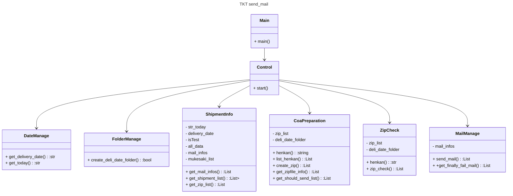
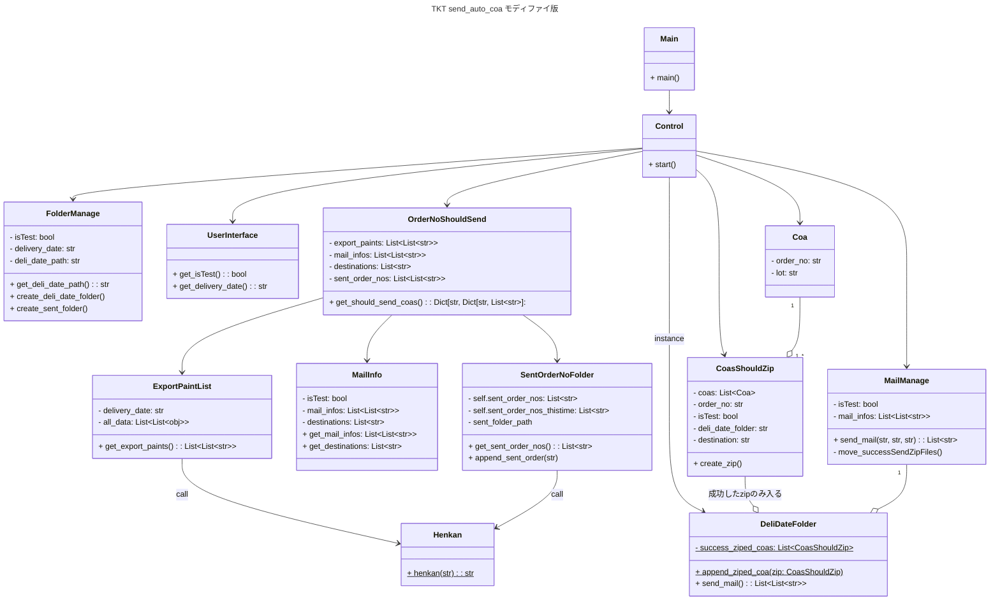
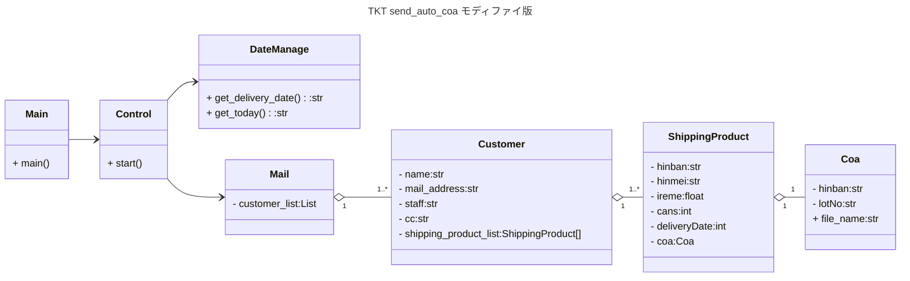

# send_auto_coaについて
## システム概要
TKT用のCoa自動送信システムです。
### 動作環境
- OS  
    - MacOs
    - Linux(WSL2:Ubunts)
    - Windows11
### 実装言語
- Python3.10 
- ShellScript(zsh)で起動ファイル作る
- Windowsの場合はbatファイル作って起動させる。
### ソースコード
- GitHub Publicリポジトリで公開</br>
### 起動方法
#### Terminalまたはコマンドプロンプトから起動する場合
1. 上記sorceCodeをgitHubから自分のPCの任意のフォルダにfetchする。cloneまたはzipダウンロード。
1. Terminalまたはコマンドプロンプトを起動して、``python main.py``で走ります。 
1. いつ納期分のCoaを送信するか訊かれますので、20250911(2025年9月11日納期の場合)を入力してEnter。
### program動作
```bash
testreport
  |
  |- 輸出
  |   |
  |   |- S7-ABC-M15R-EX_25090555T_2025911_商社A-ﾊﾟｷｽﾀﾝ_AV062.pdf
  |   |- S11-KB-U-EX_25090453T_2025911_広州-会社_C855.pdf
  |   |- S9-U333-TH-R-EX_25090353T_2025911_広州-会社_C855.pdf
  |   |- S11-K3K3A-U-R-EX_25090352T_2025911_広州-会社_C855.pdf
  |   |- S6-V2323L-U-R-EX_25082251T_2025911_商社B-北米office_F250-1.pdf
  |   |- S6-V333B54S-T-R-EX_25090252T_2025911_商社B-北米office_F250-1.pdf
  |   |- S6-V333B54S-T-R-EX_25090253T_2025911_商社B-北米office_F250-1.pdf
  |   |-                              :
  |   |-                              :
  |
  |- zipFiles

        |
        |- 20250911
               |
               |- C855.zip
               |- F250-1.zip
               |
               |- 送信済
```
1. 納入日フォルダが存在しない場合は、営業課ﾌｫﾙﾀﾞ/testreport/輸出/の下に納入日フォルダ(20250911)とその中に送信済フォルダが作られる。
1. 営業課ﾌｫﾙﾀﾞ/testreport/輸出の中にあるcoa.pdfから納入日のcoaを注番ごとにzipにまとめて、納入日フォルダの中に入れられる。
1. coa.pdfが不足していたり、zip化の時に何らかのエラーが起きるとzipファイルは作られない。
1. そして、Email送信でzipファイルが添付されて向け先に送られる。送信に成功したzipファイルは送信済フォルダの中に入れられる。そして、納入日フォルダの中のzipファイルは削除される。
1. 2回目移行に実行すると、送信済フォルダ内のzipファイルから未送信の注番を求めて、zipファイルを作り納入日フォルダに入れる。
3. 再度20250617で成績書を送信した場合、pythonは20250617ディレクトリの中を調べて、送信先とCoaが同じものが存在していたら送信しない。20250617の中に存在しないCoaのみを送信する。
1. 複数のCoaを送信する時はzipファイルにまとめてから送信する
## 仕様書
- 下図はTKTで現行のCoa自動送信システムのクラス図である。<br/>
この実装では、Controlクラスが全ての仕事を請け負っていて、完全に手続き型のProgrammingになってしまっている。codeもクソでメンテしにくいので次のように変更する。<br/>

---
そこで、TKT send_auto_coa モディファイ版は下図のように設計しなおした。(オブジェクト指向プログラミングっぽい設計)<br/>
Mainクラスから呼び出されたControlクラスはDateManageクラスにCoa送信日と今日の日時をもらう。そしてMailクラスのインスタンスを作る。MailクラスはCustomerクラスのインスタンスのリストを持っており、CustomerクラスはShippingProductクラスのインスタンスのリストを持ち、ShippingProductクラスはCoaのインスタンスをもっている。これで、Mailクラスの送信メソッドを呼び出せば、必要な顧客にCoaを送ってくれる。
should_send_coas = {'AHI832': {'タイ/小糸': [20250930T, 20250921T,...]}, 'AHI855': {'タイ/小糸': [...]} }



## logに残す項目
| 項目 | object    | クラス     |
| :--- | :---:   | :---: |
| delivery_dateに送信が必要なcoa | ExportPaintList    | Control     |
| delivery_dateに送信が必要な注文番号 |  zipfile_info   | Control     |
| 送信が完了している注文番号 |     | Control     |
| 送信が必要な注文番号 | zip_list    | Control     |
| zipに成功した注文番号 | success_zip    | Control     |
| zipに失敗した注文番号 | fail_list    | Control     |
| 送信に成功した注文番号 | success_send_mail   | Control     |
| 送信に失敗した注文番号 | fail_send_mail    | Control     |
| zipまたは送信で失敗した注文番号 | finally_fail_mail    | Control     |


